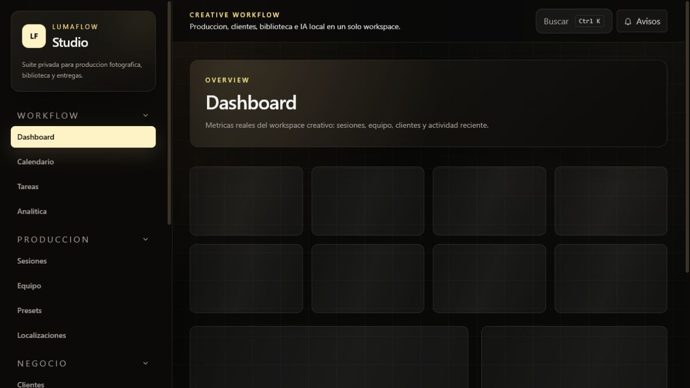
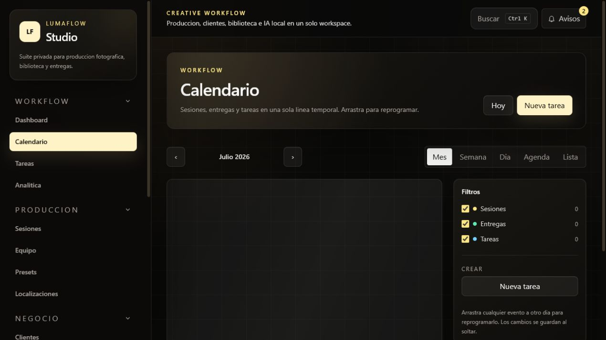
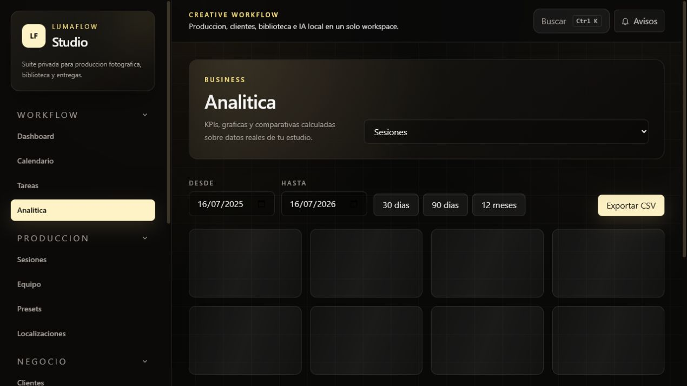
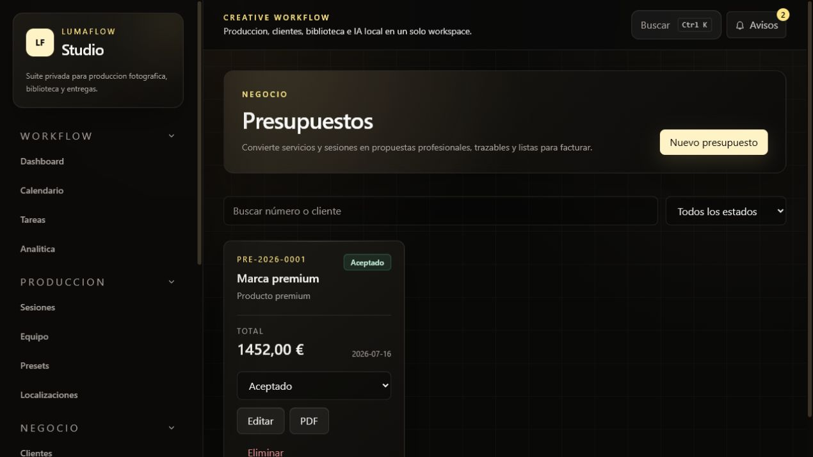
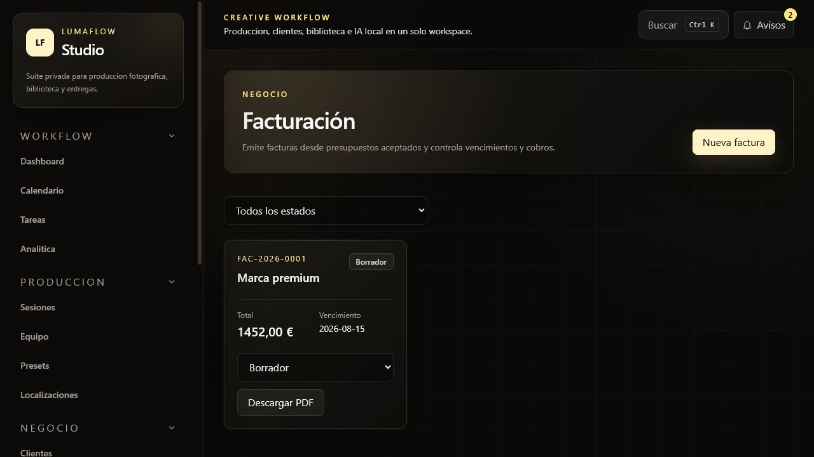
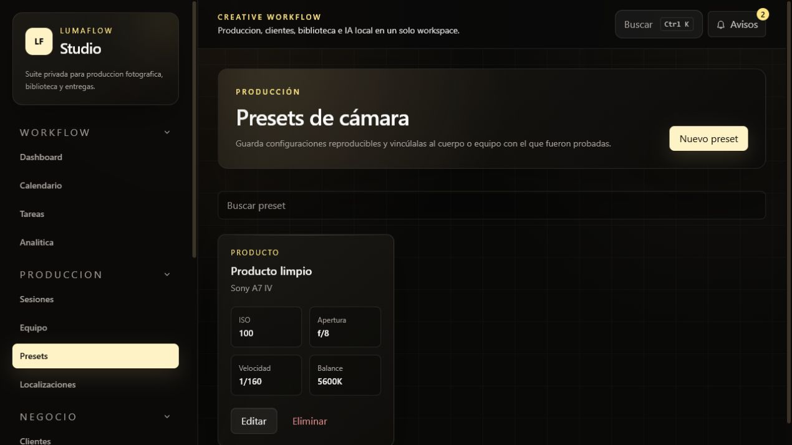
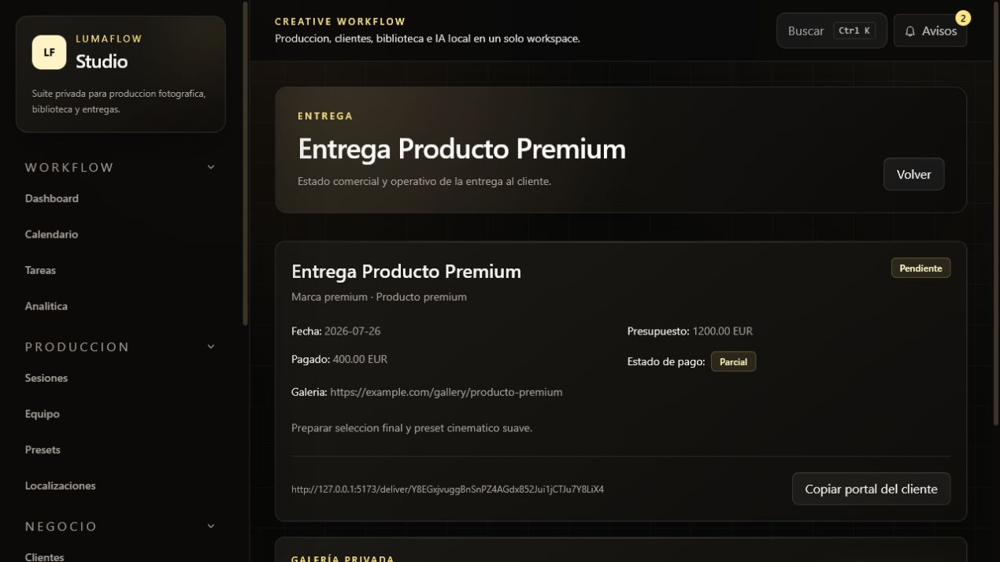
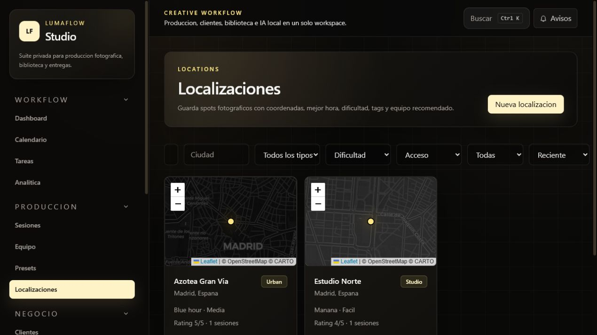
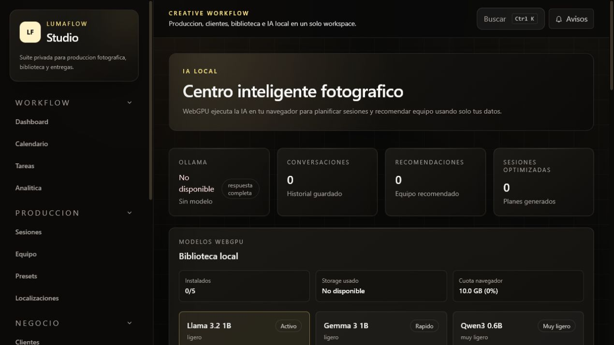

<div align="center">

# LumaFlow Studio

**Plataforma full-stack de gestion del flujo de trabajo para fotografos, con asistente de IA y modelos WebGPU locales.**

[](https://laravel.com)
[](https://react.dev)
[](https://www.mysql.com)
[](https://developer.mozilla.org/en-US/docs/Web/API/WebGPU_API)
[](LICENSE)

[Documentacion tecnica](docs/) · [API](docs/api.md) · [Arquitectura](docs/architecture.md) · [Despliegue](docs/deployment.md)

</div>

---

## Descripcion

Un fotografo profesional trabaja con sesiones, clientes, equipo y localizaciones, pero suele gestionarlo todo en hojas de calculo dispersas. LumaFlow Studio reune ese flujo completo en una sola aplicacion: planificacion, produccion, CRM ligero, entregas, analitica y un asistente de IA que **solo razona sobre los datos reales del usuario y nunca sale de su maquina**.

Es una release privada de portfolio. No busca ser un SaaS, sino demostrar arquitectura, criterio tecnico y acabado de producto sobre un dominio con reglas propias.

## Capturas

| Dashboard | Calendario | Analitica |
|---|---|---|
|  |  |  |

| Presupuestos | Facturas | Presets |
|---|---|---|
|  |  |  |

| Galeria y entregas | Localizaciones | Asistente IA |
|---|---|---|
|  |  |  |

## Stack

| Capa | Tecnologia |
|---|---|
| Frontend | React 19, Vite, React Router 7, Tailwind CSS 4, Recharts, Leaflet, PWA |
| Backend | Laravel 13, PHP 8.3+, Sanctum (tokens Bearer), Dompdf |
| Datos | MySQL 8, Eloquent |
| IA | WebGPU en navegador con WebLLM y modelos instalables; Ollama backend opcional |
| Calidad | PHPUnit, Pint, Vitest, Testing Library, oxlint, Prettier |
| Infra | PWA + Docker Compose (frontend, backend, MySQL, phpMyAdmin, Ollama opcional) |

## Arquitectura

Dos aplicaciones independientes en un monorepo. No comparten codigo ni build: se comunican solo por HTTP.

```
routes/api.php  ->  Api\XController  ->  XRequest (validacion)
                          │
                          ▼
                   App\Services\*  (logica de dominio)
                          │
                          ▼
                 Modelo + scopes  ->  XResource (serializacion)

frontend/src/api/*.js  ->  hooks  ->  features/<dominio>  ->  pages/
```

Tres decisiones que explican casi todo el codigo:

- **Multi-tenancy por `user_id`.** Sin middleware magico: cada consulta parte del scope `ownedBy()` y cada creacion cuelga de la relacion del usuario.
- **404 en lugar de 403.** Un 403 sobre un recurso ajeno confirmaria que existe.
- **La logica vive en servicios.** Los controladores son delgados y testeables.

Detalle completo en [docs/architecture.md](docs/architecture.md).

## Modulos

| Modulo | Que hace |
|---|---|
| **Dashboard** | Metricas reales, agenda del dia, tareas pendientes, progreso mensual, timeline de actividad |
| **Calendario** | Vistas mes, semana, dia, agenda y lista. Drag & drop para reprogramar sesiones, entregas y tareas |
| **Sesiones** | CRUD con cliente, tipo, estado, localizacion, checklists tipadas y timeline automatico |
| **Tareas** | Prioridad, estado, fecha limite, relacion con sesion y cliente, resumen de vencidas, acciones masivas |
| **Checklists** | Plantillas por tipo (equipo, preparacion, edicion, entrega), items reordenables, progreso en porcentaje, duplicado |
| **Localizaciones** | Mapa Leaflet, coordenadas, acceso, permisos, coste, clima, estaciones, equipo recomendado |
| **Clientes y entregas** | CRM ligero conectado a sesiones, presupuestos y galerias |
| **Presupuestos y facturas** | Conceptos, IVA, estados, numeracion por estudio y documentos PDF |
| **Galeria de cliente** | Carga multiple, portal privado, aprobacion y seleccion de favoritas |
| **Presets** | Ajustes de camara reutilizables y vinculados al equipo real |
| **Analitica** | KPIs y graficas Recharts sobre datos reales, tablas comparativas, rangos de fechas |
| **Busqueda global** | `Ctrl/Cmd + K`. Resultados agrupados, navegacion por teclado |
| **Notificaciones** | Centro persistido en BD, contador global, marcado y limpieza |
| **Asistente IA** | Chat con contexto, planes de sesion, recomendador de equipo |
| **Estado del sistema** | `/app/system`: sondas en vivo de API, MySQL, storage, cache y compatibilidad Ollama |
| **PWA** | Aplicacion instalable con shell offline; los modelos WebGPU siguen bajo demanda |

## Instalacion

Requisitos: PHP 8.3+, Composer, Node 22+, MySQL 8. Para IA en la SPA hace falta un navegador con WebGPU. Ollama es opcional.

```bash
git clone https://github.com/AVL05/lumaflow-studio.git
cd lumaflow-studio
```

```sql
CREATE DATABASE lumaflow_studio CHARACTER SET utf8mb4 COLLATE utf8mb4_unicode_ci;
```

```bash
npm install     # dependencias raiz
npm run setup   # composer install, APP_KEY, storage:link, migrate, npm install
npm run start   # backend :8000 y frontend :5173, en una sola terminal
```

Usuario de ejemplo tras sembrar (`php artisan db:seed`): `test@example.com` / `password`.

## Docker

```bash
cp .env.example .env
docker compose up --build
```

| Servicio | URL |
|---|---|
| Frontend | http://localhost:8080 |
| Backend | http://localhost:8000 |
| phpMyAdmin | http://localhost:8081 |

Con el modelo de IA en contenedor:

```bash
docker compose --profile ollama up --build
docker compose exec ollama ollama pull llama3.1
```

Sin ese perfil, el backend usa el Ollama del host. Detalles en [docs/deployment.md](docs/deployment.md).

## Variables

Ninguna contiene secretos reales; son valores de desarrollo. Los `.env` nunca se commitean.

**Raiz** (`.env`, solo para Docker): `APP_KEY`, `DB_*`, `FRONTEND_URLS`, `VITE_API_URL`, `OLLAMA_*`, `SEED_DATABASE`.

**`backend/.env`**:

```env
APP_NAME="LumaFlow Studio"
APP_URL=http://localhost:8000
FRONTEND_URLS=http://localhost:5173,http://127.0.0.1:5173

DB_CONNECTION=mysql
DB_DATABASE=lumaflow_studio
DB_USERNAME=root
DB_PASSWORD=

FILESYSTEM_DISK=public
OLLAMA_URL=http://127.0.0.1:11434
OLLAMA_MODEL=llama3.1
OLLAMA_TIMEOUT=30
OLLAMA_MAX_CONTEXT=12000
```

**`frontend/.env`**:

```env
VITE_API_URL=http://localhost:8000/api
VITE_WEBGPU_AI_MODEL=Llama-3.2-1B-Instruct-q4f16_1-MLC
```

## Scripts

Desde la raiz:

| Script | Que hace |
|---|---|
| `npm run start` | Backend + frontend en una sola terminal |
| `npm run dev` | Alias de `start` |
| `npm run build` | Build de produccion del frontend |
| `npm run lint` | oxlint + `pint --test` |
| `npm run format` | Prettier + Pint |
| `npm run test` | PHPUnit + Vitest |
| `npm run setup` | Instalacion completa |
| `npm run docker:up` / `docker:down` / `docker:reset` | Ciclo de vida de Docker |

## Estructura

```
lumaflow-studio/
├── backend/
│   ├── app/
│   │   ├── Http/{Controllers/Api, Requests, Resources}
│   │   ├── Models/{, Concerns}
│   │   ├── Policies/
│   │   ├── Services/
│   │   └── Support/AuditLog.php
│   ├── database/{migrations, seeders}
│   ├── resources/views/pdf
│   ├── routes/api.php
│   ├── tests/{Feature, Unit}
│   └── Dockerfile
├── frontend/
│   ├── src/{api, app, components, features, hooks, pages, styles, test}
│   └── Dockerfile
├── docs/
├── docker-compose.yml
└── LICENSE
```

## IA

El asistente principal corre con **WebGPU en el navegador** mediante WebLLM: no hay claves de API ni proveedores externos. El usuario puede instalar varios modelos recomendados, comparar perfil/descarga/VRAM, activar el que prefiera y desinstalar los que ya no quiera mantener cacheados. El modulo de IA se carga bajo demanda para no penalizar el resto de la SPA.

El backend conserva servicios Ollama como compatibilidad local avanzada para endpoints de IA, pero la SPA no depende de tener Ollama instalado. Las tareas estructuradas (planificar una sesion, recomendar equipo) piden JSON estricto y se parsean en el cliente.

Detalle en [docs/ai.md](docs/ai.md).

## Testing

```bash
npm run test                                    # todo
cd backend && php artisan test --filter=AuthTest
cd frontend && npm run test:coverage
```

56 tests de backend (auth, CRUD, permisos, workflow, facturacion, galerias, salud y policies) y 33 de frontend (hooks, utilidades del calendario y componentes criticos).

`phpunit.xml` apunta a SQLite en memoria. Si tu PHP no trae `pdo_sqlite`:

```bash
DB_CONNECTION=mysql DB_DATABASE=lumaflow_studio_testing php artisan test
```

## Roadmap

Lo que **no** esta implementado, y por que, en [docs/roadmap.md](docs/roadmap.md). Resumen: streaming real de IA, persistencia del chat WebGPU, contratos, comparacion before/after y kanban de tareas.

## Contribucion

Proyecto personal de portfolio; no se buscan contribuciones externas. Si aun asi quieres proponer un cambio:

1. Abre un issue describiendo el problema antes de escribir codigo.
2. Respeta las convenciones: `vendor/bin/pint` en backend, `npm run lint && npm run format` en frontend.
3. Anade tests para el comportamiento que cambies.
4. Commits en imperativo, con el ambito por delante: `feat(calendar): ...`, `fix(auth): ...`.

## Creditos

Diseno y desarrollo: **Alex Vicente Lopez**.

Construido sobre [Laravel](https://laravel.com), [React](https://react.dev), [Tailwind CSS](https://tailwindcss.com), [Recharts](https://recharts.org), [Leaflet](https://leafletjs.com) y [WebLLM](https://webllm.mlc.ai/). Mapas base de [CARTO](https://carto.com) sobre datos de [OpenStreetMap](https://www.openstreetmap.org).

## Licencia

[MIT](LICENSE).
