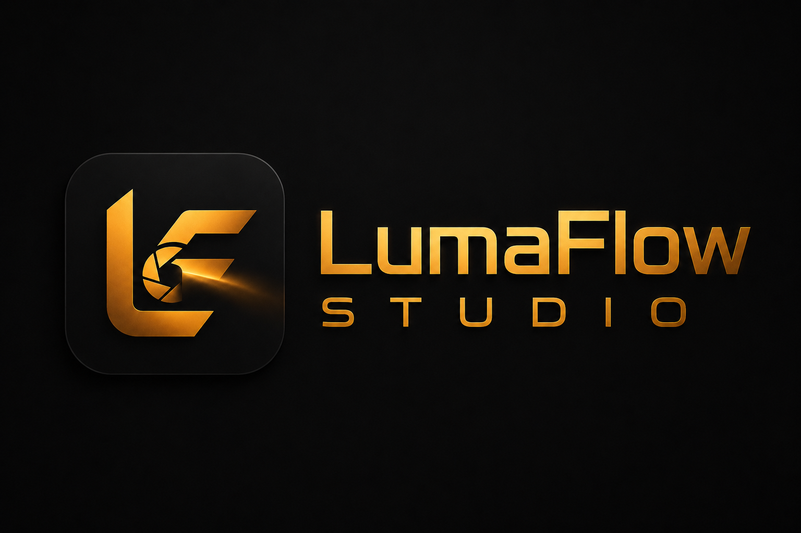

<div align="center">



# LumaFlow Studio

**Gestiona todo tu estudio fotográfico desde un único lugar.**

Clientes, trabajos, reservas, presupuestos, facturas, sesiones y entregas conectados en un mismo flujo.

**Beta pública gratuita · Sin tarjeta**

[Probar LumaFlow](https://lumaflow.aleviclop.dev/register) · [Explorar demo](https://lumaflow.aleviclop.dev/demo) · [Casos de uso](https://lumaflow.aleviclop.dev/features) · [Precio](https://lumaflow.aleviclop.dev/pricing) · [Privacidad](https://lumaflow.aleviclop.dev/privacy) · [Ver documentación](docs/) · [Estado del servicio](https://lumaflow-api.aleviclop.dev/api/health)

[](https://laravel.com)
[](https://react.dev)
[](https://www.mysql.com)
[](https://developer.mozilla.org/en-US/docs/Web/API/WebGPU_API)
[](LICENSE)

</div>

---

## Qué es LumaFlow

LumaFlow Studio es una plataforma de gestión para fotógrafos y pequeños estudios. Reúne la operación diaria y la relación con el cliente sin obligarte a mantener calendarios, hojas de cálculo, documentos y galerías desconectados.

El producto está en **beta pública**. Puedes crear una cuenta y utilizar las funcionalidades actuales de forma gratuita, sin introducir una tarjeta. Todavía no existe un plan de pago ni un proceso de cobro.

El objetivo de esta etapa es validar el flujo con usuarios reales, detectar qué módulos aportan más valor y mejorar el producto antes de definir límites o planes futuros.

## Pruébalo sin registrarte

La [demo interactiva](https://lumaflow.aleviclop.dev/demo) utiliza datos ficticios y no persiste cambios. Permite recorrer una jornada de trabajo, consultar clientes, explorar la agenda y probar la selección de favoritas de una entrega.

| Resumen                     | Agenda                      | Cliente y entrega                     |
| --------------------------- | --------------------------- | ------------------------------------- |
| Métricas y trabajo en curso | Sesiones, tareas y entregas | Actividad comercial y galería privada |

No consulta información de producción ni comparte datos entre usuarios.

## Un flujo completo para el estudio

1. **Recibe reservas.** Centraliza solicitudes y datos iniciales del cliente.
2. **Controla el trabajo.** Reúne cliente, presupuesto, contrato, pago, sesión, tareas, equipo, galería y entrega en un único proyecto.
3. **Gestiona el negocio.** Crea presupuestos, controla estados y genera facturas PDF.
4. **Produce y da seguimiento.** Consulta agenda, notificaciones, progreso y actividad.
5. **Entrega.** Publica una galería privada para revisión, favoritas y aprobación.
6. **Analiza.** Revisa ingresos, carga de trabajo y evolución del estudio con datos reales.

## Capturas reales

| Dashboard                                                | Calendario                                               | Analítica                                                |
| -------------------------------------------------------- | -------------------------------------------------------- | -------------------------------------------------------- |
|  |  |  |

| Presupuestos                                             | Facturas                                               | Galería del cliente                                          |
| -------------------------------------------------------- | ------------------------------------------------------ | ------------------------------------------------------------ |
|  |  |  |

| Localizaciones                                                | Presets                                              | IA local                                                          |
| ------------------------------------------------------------- | ---------------------------------------------------- | ----------------------------------------------------------------- |
|  |  |  |

## Funcionalidades actuales

| Área                        | Funcionalidades                                                               |
| --------------------------- | ----------------------------------------------------------------------------- |
| **Dashboard**               | Agenda, tareas pendientes, progreso mensual, actividad y métricas del estudio |
| **Calendario**              | Mes, semana, día, agenda y lista; reprogramación mediante drag and drop       |
| **Trabajos**                | Pipeline, workflows por especialidad, contrato, pagos y timeline unificado    |
| **Sesiones**                | Cliente, tipo, estado, localización, checklist y timeline                     |
| **Tareas y checklists**     | Prioridades, vencimientos, acciones masivas y plantillas reutilizables        |
| **Clientes**                | CRM ligero conectado a trabajos, presupuestos, facturas y entregas            |
| **Reservas**                | Solicitudes públicas vinculadas a disponibilidad y seguimiento interno        |
| **Presupuestos y facturas** | Conceptos, IVA, estados, numeración por estudio y PDF                         |
| **Entregas**                | Portal privado, carga múltiple, favoritas y aprobación del cliente            |
| **Equipo y presets**        | Inventario y ajustes de cámara reutilizables                                  |
| **Localizaciones**          | Mapa, acceso, permisos, coste, clima y equipo recomendado                     |
| **Analítica**               | KPIs y gráficas calculados sobre la actividad real                            |
| **IA local**                | Chat contextual, planes de sesión y recomendación de equipo                   |
| **PWA**                     | Aplicación instalable con shell offline                                       |

## Privacidad e IA local

La experiencia principal de inteligencia artificial se ejecuta en el navegador mediante WebGPU y WebLLM:

- no requiere claves de proveedores externos;
- el usuario instala y elige un modelo compatible;
- los datos usados como contexto pertenecen a su propia cuenta;
- la ausencia de IA no bloquea el resto de la aplicación;
- Ollama queda disponible como compatibilidad local avanzada del backend.

Consulta [docs/ai.md](docs/ai.md) para conocer modelos, requisitos y limitaciones.

## Estado de la beta

La beta actual es gratuita y no solicita tarjeta. Esto significa:

- acceso a todos los módulos disponibles hoy;
- demo pública sin registro;
- evolución frecuente del producto;
- posibilidad de cambios de interfaz y contrato durante la beta;
- sin compromiso sobre precios o límites futuros hasta que se publiquen expresamente.

LumaFlow ya funciona como producto desplegado, pero sigue siendo experimental. No debe considerarse todavía un servicio crítico ni utilizarse como única copia de documentos o fotografías.

## Arquitectura

El repositorio contiene dos aplicaciones independientes que se comunican por HTTP:

```text
frontend/src/api/*.js  ->  hooks  ->  features  ->  pages
                              |
                              v
routes/api.php  ->  Controller  ->  FormRequest  ->  Service
                                              |
                                              v
                                      Model + Resource
```

Principios principales:

- **Aislamiento por usuario.** Cada consulta parte de `ownedBy()`.
- **404 para recursos ajenos.** No se confirma la existencia de información de otra cuenta.
- **Controladores delgados.** La lógica de dominio vive en servicios.
- **API y SPA separadas.** El frontend utiliza tokens Bearer de Sanctum.
- **IA bajo demanda.** WebLLM no penaliza la carga inicial de la aplicación.

Más detalle en [docs/architecture.md](docs/architecture.md).

## Stack

| Capa            | Tecnología                                                                |
| --------------- | ------------------------------------------------------------------------- |
| Frontend        | React 19, Vite, React Router 7, Tailwind CSS 4, Recharts, Leaflet, PWA    |
| Backend         | Laravel 13, PHP 8.3+, Sanctum, Dompdf                                     |
| Datos           | MySQL compatible, Eloquent                                                |
| IA              | WebGPU, WebLLM y Ollama opcional                                          |
| Calidad         | PHPUnit, Pint, Vitest, Testing Library, oxlint y Prettier                 |
| Infraestructura | Vercel, Render, TiDB Cloud, almacenamiento S3 compatible y Docker Compose |

## Desarrollo local

Requisitos: PHP 8.3+, Composer, Node 22+ y pnpm 10+.

```bash
git clone https://github.com/AVL05/lumaflow-studio.git
cd lumaflow-studio
pnpm run start
```

`pnpm run start` prepara SQLite, instala dependencias cuando hace falta y levanta:

| Servicio             | URL                          |
| -------------------- | ---------------------------- |
| Landing y aplicación | `http://localhost:5173`      |
| Demo interactiva     | `http://localhost:5173/demo` |
| API Laravel          | `http://localhost:8000/api`  |

React, JavaScript y CSS utilizan HMR. Los cambios PHP se aplican en la siguiente petición. No necesitas Docker ni MySQL para empezar.

El alta local sigue `crear cuenta -> verificar email -> configurar estudio -> elegir primer paso -> dashboard`. Tras el onboarding puedes crear el primer trabajo, cargar un workspace ficticio o importar clientes mediante CSV. Como `pnpm run start` usa correo por log, copia el enlace de verificacion desde `backend/storage/logs/laravel.log`.

El dashboard incorpora un checklist de activacion 0/5 basado en datos reales: estudio configurado, primer cliente, primer trabajo, reservas activadas y primera sesion. LumaFlow solo muestra el estado **Estudio operativo** cuando existe una entrega completada o se activa un enlace publico de reservas; los datos de ejemplo nunca completan ese hito.

Dentro del producto, la navegación prioriza Inicio, Trabajos, Calendario y Clientes. El botón global `+ Crear` abre clientes, trabajos, sesiones, presupuestos, facturas, tareas o entregas desde cualquier módulo. `Ctrl/Cmd + K` abre búsqueda y comandos; `Ctrl/Cmd + L` abre Luma con el contexto de la pantalla actual. En móvil, esas cuatro rutas forman una barra inferior y el resto queda bajo **Más**.

### Docker

```bash
cp .env.example .env
docker compose up --build
```

| Servicio   | URL                     |
| ---------- | ----------------------- |
| Frontend   | `http://localhost:8080` |
| Backend    | `http://localhost:8000` |
| phpMyAdmin | `http://localhost:8081` |

Consulta [docs/deployment.md](docs/deployment.md) para Docker, producción y despliegue automático.

## Variables principales

`frontend/.env`:

```env
VITE_API_URL=http://localhost:8000/api
VITE_WEBGPU_AI_MODEL=Llama-3.2-1B-Instruct-q4f16_1-MLC
```

`backend/.env` contiene la conexión de datos, orígenes permitidos, almacenamiento y compatibilidad Ollama. Nunca se versionan credenciales ni archivos `.env`; solo `.env.example`.

## Calidad

```bash
pnpm run lint
pnpm run test
pnpm run build
```

La automatización de GitHub ejecuta formato, lint, tests, build PWA e imágenes Docker. Después del despliegue, un smoke test comprueba la landing, el favicon y el estado de la API.

## Roadmap

Las siguientes fases priorizan:

- persistencia del chat WebGPU;
- contratos y aprobaciones formales;
- caducidad de galerías y descarga en lote;
- roles y colaboración por estudio;
- pagos y conciliación de facturas;
- definición de límites y planes después de validar el uso real.

El estado completo está en [docs/roadmap.md](docs/roadmap.md).

## Open source y contribuciones

LumaFlow es un producto experimental open source con licencia MIT. El repositorio también documenta decisiones de arquitectura y sirve como trabajo de portfolio, pero el producto se diseña para uso real y aprendizaje con usuarios.

Antes de proponer un cambio:

1. abre un issue explicando el problema o caso de uso;
2. evita incluir información real de clientes o credenciales;
3. ejecuta lint, tests y build;
4. mantén los cambios compatibles con la arquitectura actual.

## Seguridad

- No publiques `.env`, tokens, correos, prompts ni respuestas de IA.
- No uses datos reales en issues, demos o capturas.
- Reporta vulnerabilidades de forma privada al responsable del repositorio.

## Licencia y autoría

[MIT](LICENSE). Diseñado y desarrollado por [Alex Vicente López](https://aleviclop.dev).
